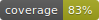

# Risa

---

<div align="center">

[](https://github.com/martokk/risa/actions?query=workflow%3Abuild)
[](https://pypi.org/project/risa/)
[](https://github.com/martokk/risa/pulls?utf8=%E2%9C%93&q=is%3Apr%20author%3Aapp%2Fdependabot)

[](https://github.com/psf/black)
[](https://github.com/PyCQA/bandit)
[](https://github.com/martokk/risa/blob/master/.pre-commit-config.yaml)
[](https://github.com/martokk/risa/releases)
[](https://github.com/martokk/risa/blob/master/LICENSE)


A python project created by Martokk.

</div>

---

## Features

## Installation

```bash
pip install risa
```

Then you can run

```bash
risa --help
```

## Usage

## 📈 Releases

You can see the list of available releases on the [GitHub Releases](https://github.com/martokk/risa/releases) page.

## 🛡 License

[](https://github.com/martokk/risa/blob/master/LICENSE)

This project is licensed under the terms of the `MIT` license. See [LICENSE](https://github.com/martokk/risa/blob/master/LICENSE) for more details.
